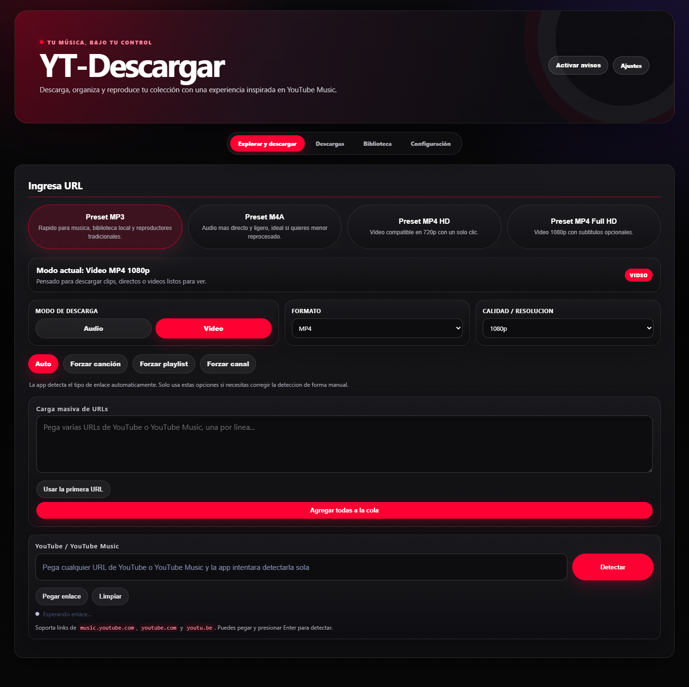
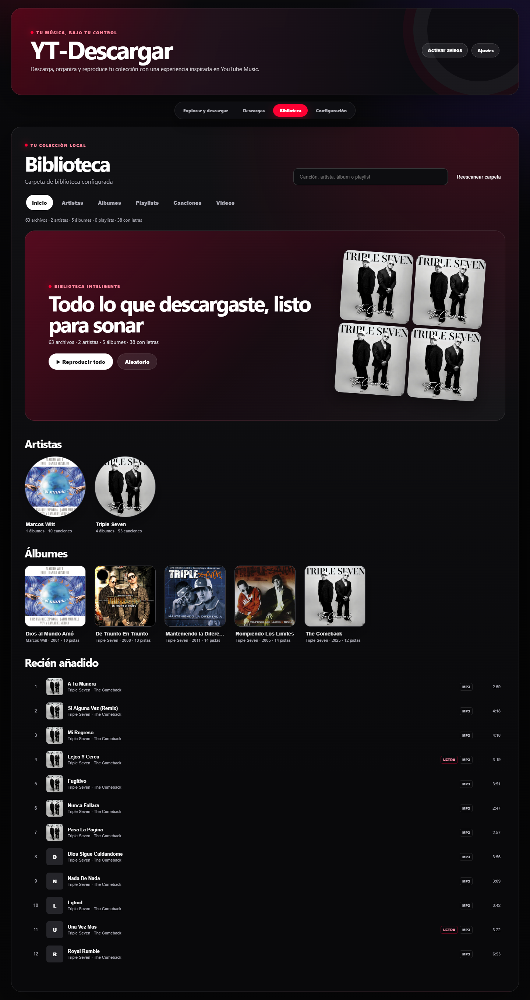
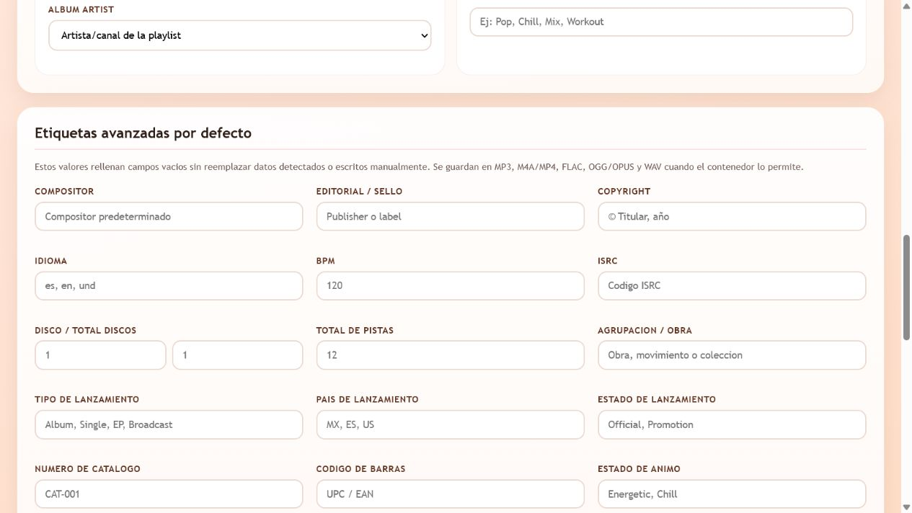
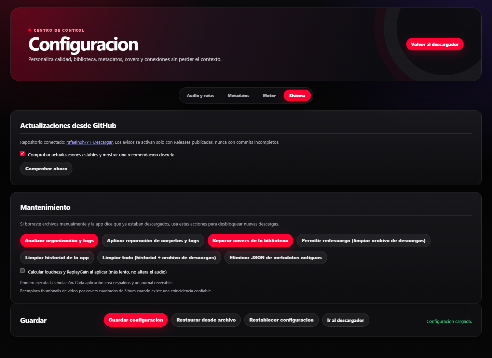

# YT-Descargar

[](CHANGELOG.md)
[](https://github.com/rafaeln0h/YT-Descargar/actions/workflows/tests.yml)
[](LICENSE)

Aplicación local, gratuita y de código abierto para detectar, descargar,
etiquetar, organizar y reproducir contenido autorizado de YouTube y YouTube
Music mediante `yt-dlp` y FFmpeg.

> Descarga únicamente contenido propio, de dominio público, con licencia
> compatible o para el que tengas permiso expreso. Lee [Uso legal](docs/LEGAL.md).

| Descarga y detección | Biblioteca navegable |
|---|---|
|  |  |
| Metadatos y fuentes | Mantenimiento y diagnóstico |
|  |  |

## Funciones de v0.013

- Videos, canciones, playlists, álbumes y canales.
- Audio MP3, M4A, FLAC, OGG/OPUS y WAV; video MP4 y MKV.
- Cola, reintentos, pausa/cancelación, archivo anti-duplicados e historial.
- Cola por lotes persistente: continúa al cambiar de página y se recupera tras reiniciar.
- Tags musicales, técnicos y de procedencia en formatos compatibles.
- Enriquecimiento opcional y conservador con YouTube Music, MusicBrainz,
  AcoustID/Chromaprint y Discogs; overrides manuales cuando una fuente no responde.
- Metadatos incrustados directamente; no crea archivos `.info.json`.
- Covers cuadrados de álbum con procedencia registrada, letras desde captions/LRCLIB,
  plantillas de carpetas y nombres.
- Sencillos agrupables en `Artista/Singles`, opcionalmente por año o mediante una
  plantilla personalizada, sin mezclar álbumes ni EP.
- Biblioteca visual por artistas, álbumes, playlists, canciones y videos, con covers,
  letras, cola contextual y streaming HTTP Range.
- Reproductor con anterior/siguiente, progreso, volumen, silencio, aleatorio,
  repetición, cola y controles Media Session.
- Reparación simulable de tags y covers existentes, journal reversible y análisis
  técnico/ReplayGain cuando las herramientas están disponibles.
- Interfaz unificada inspirada en YouTube Music: pestañas, transiciones accesibles,
  biblioteca lateral, PWA y notificaciones opcionales.
- Logs rotativos y endpoints de salud/capacidades.

## Inicio rápido en Windows

1. Descarga `YT-Descargar-v0.013.zip` desde la
   [release más reciente](https://github.com/rafaeln0h/YT-Descargar/releases/latest).
2. Verifica el archivo con el SHA-256 publicado en `SHA256SUMS.txt`.
3. Instala [Python 3.11 o posterior](https://www.python.org/downloads/windows/).
4. Extrae el ZIP y ejecuta `start.bat`.
5. Abre `http://127.0.0.1:5000` si el navegador no se abre solo.
6. Pega una URL, pulsa **Detectar**, revisa formato y tags, y descarga.
7. Abre **Biblioteca** para reproducir los archivos locales.

Instalación manual:

```powershell
py -m venv .venv
.\.venv\Scripts\Activate.ps1
python -m pip install -r requirements.txt
python app_playlist.py
```

Linux/macOS:

```bash
python3 -m venv .venv
source .venv/bin/activate
python -m pip install -r requirements.txt
python app_playlist.py
```

FFmpeg debe estar en `PATH` o en `ffmpeg_portable/`. Chromaprint/`fpcalc` es
opcional y sólo se necesita para AcoustID. Consulta [Dependencias y APIs](docs/DEPENDENCIES_AND_APIS.md)
y [Solución de problemas](docs/TROUBLESHOOTING.md).

La instalación incluye el grupo oficial `yt-dlp[default]`, `yt-dlp-ejs`, Deno y
`curl-cffi`. En Configuración → Sistema puedes confirmar el runtime activo,
FFmpeg y las versiones cargadas por la aplicación.

## Estructura

```text
app_playlist.py          Orquestación y compatibilidad Flask
ymd/
  enrichment.py          Enriquecimiento MusicBrainz con caché y rate limit
  ytmusic.py             Álbumes y créditos públicos de YouTube Music
  acoustid.py            Fingerprint local y consulta AcoustID opcional
  discogs.py             Créditos y géneros Discogs opcionales
  audio_analysis.py      Propiedades técnicas y ReplayGain
  covers.py              Selección, normalización e incrustación de covers
  library.py             Biblioteca segura y resolución de medios
  logging_config.py      Logs estructurados y rotativos
  metadata.py            Modelo, tags y letras multiformato
  overrides.py           Correcciones manuales persistentes
  repair.py              Simulación, reparación y journal de biblioteca
  routes.py              API de biblioteca y diagnóstico
  updates.py             Comprobación discreta de GitHub Releases
  version.py             Fuente única de versión
static/                  Estilos y minirreproductor
templates/               Interfaz Flask
tests/                   Pruebas unitarias
docs/                    Diseño, fuentes, roadmap y operación
```

## API local

| Endpoint | Uso |
|---|---|
| `GET /api/library?limit=300&q=texto` | Lista medios bajo la raíz configurada |
| `GET /api/library/media/<id>` | Reproduce con soporte HTTP Range |
| `GET /api/library/artwork/<id>` | Extrae el cover incrustado bajo demanda |
| `GET /api/library/lyrics/<id>` | Devuelve letras incrustadas bajo demanda |
| `POST /api/library/rescan` | Reconstruye el catálogo y elimina referencias obsoletas |
| `GET /api/system/health` | Salud, versión y rutas activas |
| `GET /api/system/capabilities` | Capacidades para clientes futuros |
| `GET /api/system/update` | Compara la version local con la ultima GitHub Release |
| `GET /api/system/logs?limit=200` | Últimas líneas del log |
| `GET/POST /api/metadata/overrides` | Consulta o registra correcciones manuales |
| `GET /api/maintenance/repair-covers` | Estado de reparación de covers |
| `POST /api/maintenance/repair-covers` | Inicia la reparación en segundo plano |
| `GET/POST /api/maintenance/repair-metadata` | Simula, aplica o revierte reparación de tags |

### Publicar una actualización

El cliente no avisa por cada `git push`: solo recomienda actualizar cuando existe una
GitHub Release estable más reciente. Antes de publicar, actualiza la versión tanto en
`ymd/version.py` como en `pyproject.toml`, integra los cambios en `main` y crea el tag:

```powershell
$tag = "vX.XXX"
git tag -a $tag -m "YT-Descargar $tag"
git push origin main
git push origin $tag
```

El workflow `publish-release` ejecuta las pruebas, valida que el tag coincida con la
versión de la aplicación y publica la Release con un ZIP y su checksum SHA-256.
En la siguiente comprobación, los clientes verán un aviso discreto con enlace a
sus cambios; nunca se reemplaza código automáticamente.

### Organización inteligente de playlists

- Álbum oficial de YouTube Music: `Artista del álbum/Año - Álbum/01 - Nombre.ext`.
- Playlist normal: `Playlists/Nombre de playlist/01 - Nombre.ext`.
- Las playlists mixtas conservan artista, álbum y año reales cuando YouTube Music los
  entrega; además guardan nombre, dueño, URL, posición y total de playlist como tags.
- Al finalizar una playlist normal se crea un archivo `.m3u8` para conservar el orden.

Los álbumes oficiales priorizan la imagen cuadrada de la playlist de YouTube Music.
Si no está disponible, la aplicación intenta Cover Art Archive y Deezer con una
coincidencia conservadora; una miniatura de video sólo se usa como último recurso y
se recorta al centro. Desde **Configuración > Sistema** puedes reparar covers antiguos.

Los identificadores de medios no aceptan rutas libres: se resuelven dentro de
la biblioteca configurada. La aplicación escucha en localhost por defecto.

## Desarrollo

```powershell
python -m pip install -r requirements-dev.txt
python -m unittest discover -s tests -v
python -m compileall app_playlist.py ymd
ruff check app_playlist.py ymd tests
```

Antes de proponer cambios, lee [CONTRIBUTING.md](CONTRIBUTING.md),
[GOVERNANCE.md](GOVERNANCE.md) y [SECURITY.md](SECURITY.md). Toda integración
requiere revisión y aprobación del mantenedor `@rafaeln0h`.

Errores, problemas de tags/covers, preguntas y propuestas tienen formularios
dedicados. Consulta [Comunidad y solicitudes](docs/COMMUNITY.md) o participa en
[GitHub Discussions](https://github.com/rafaeln0h/YT-Descargar/discussions).

## Documentación

- [Notas de v0.013](docs/releases/v0.013.md)
- [Notas de v0.012](docs/releases/v0.012.md)
- [Arquitectura](docs/ARCHITECTURE.md)
- [Tags y letras](docs/TAGS.md)
- [Biblioteca y reproductor](docs/LIBRARY_PLAYER.md)
- [Enlaces de artista y discografía](docs/YOUTUBE_MUSIC_LINKS.md)
- [API local](docs/API.md)
- [Dependencias, APIs y privacidad](docs/DEPENDENCIES_AND_APIS.md)
- [Comunidad y solicitudes](docs/COMMUNITY.md)
- [Comparativa comercial](docs/COMMERCIAL_COMPARISON.md)
- [Fuentes y atribuciones](docs/SOURCES.md)
- [Roadmap v0.013–v0.016](docs/ROADMAP.md)
- [Plan móvil y multiplataforma](docs/MOBILE_AND_CROSS_PLATFORM.md)
- [Proceso de publicación](docs/RELEASE_PROCESS.md)
