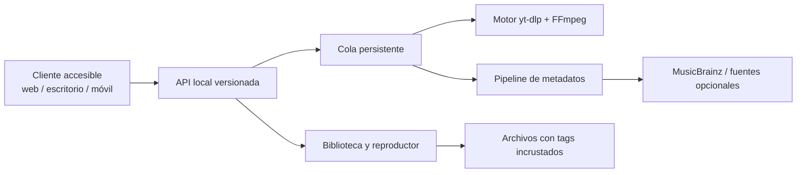

# Plan móvil y multiplataforma

## Estado actual

El backend Python/Flask, yt-dlp y FFmpeg funciona como aplicación local en
Windows, Linux y macOS; v0.013 se valida en Windows y mediante CI en Windows y
Ubuntu con Python 3.11 y 3.13. La UI web ya
separa parcialmente cliente, biblioteca y servicios, lo que reduce el trabajo
para nuevos frontends.

### Base preparada en la aplicación web

- `static/manifest.webmanifest`: instalación como PWA.
- `service-worker.js`: notificaciones persistentes y retorno a la actividad de descargas.
- `static/js/app-shell.js`: permiso explícito, deduplicación y política de
  silencio durante la reproducción.
- Media Session: metadatos y controles del sistema para audio local.
- Cola persistente del backend: el trabajo largo no depende de mantener una
  página abierta.

En el entorno Windows actual están disponibles Node.js 24 y npm 11. El JDK,
Android SDK/Android Studio y `adb` todavía no están instalados. iOS requiere un
equipo macOS con Xcode para compilar, firmar y probar; no se puede completar esa
cadena desde Windows.

## Arquitectura objetivo

La API de capacidades permite que un cliente oculte funciones que su plataforma
no soporte.

## Etapas

### Escritorio

1. Consolidar Flask como servicio local ligado a loopback.
2. Separar dominio/cola de las rutas HTTP.
3. Empaquetar con un shell ligero como Tauri o instaladores nativos.
4. Firmar, generar checksums y actualizar sin incluir cookies/configuración.

### Android

- Primera opción: cliente que controle un motor local empaquetado o un servidor
  personal del usuario.
- Segunda opción: distribución directa/F-Droid si dependencias y política lo
  permiten.
- Usar almacenamiento con alcance, selector de documentos, notificaciones y
  servicio en primer plano para tareas largas.
- Nunca solicitar permisos generales de archivos si un permiso acotado basta.

Para el cliente futuro se recomienda Capacitor sobre un frontend web estático
separado. No se debe apuntar `webDir` directamente a las plantillas Jinja: hoy
dependen del servidor Flask y de rutas relativas `/api/*`. Primero se extraerá
un cliente consumiendo la API versionada; después se añadirán las plataformas
Android/iOS y los plugins nativos de notificaciones y almacenamiento.

### iOS/iPadOS

Apple indica que las apps no deben guardar, convertir ni descargar medios de
terceros sin autorización explícita. Por eso el producto iOS debe diseñarse
como:

- reproductor y organizador de archivos propios/importados;
- cliente de un servidor personal del usuario;
- descargador sólo para proveedores con autorización y API compatibles.

No debe depender de yt-dlp dentro de App Store ni prometer descarga genérica de
YouTube. La distribución, revisión legal y derechos del contenido son hitos
previos, no detalles posteriores.

## Requisitos transversales

- Accesibilidad: teclado, lector de pantalla, contraste y áreas táctiles.
- Privacidad: sin cuenta ni telemetría por defecto.
- Internacionalización desde claves, inicialmente español e inglés.
- Base de datos de jobs/biblioteca con migraciones.
- API versionada, autenticación sólo si deja localhost y TLS para red.
- Pruebas de contrato para que los clientes no dependan del monolito.
